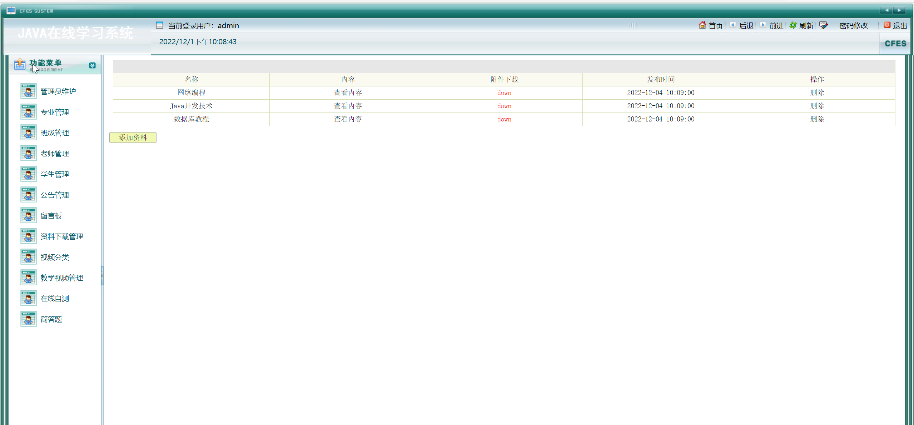
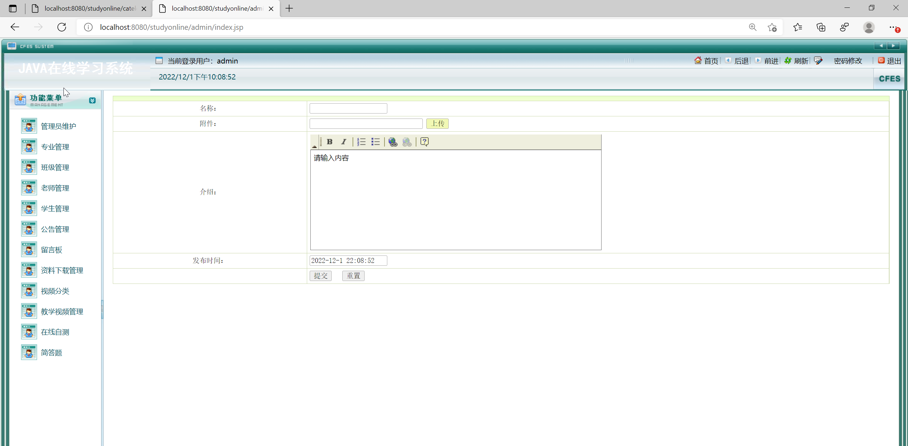

<h1 align="center">基于JSP+Servlet的在线学习系统【带文档】</h1>

<h4> 完整代码获取地址：从戎源码网（https://armycodes.com/） </h4>
<h4> 作者微信：19941326836 QQ：605739993 QQ群：655392706 </h4>
<h4> 承接计算机毕设、Java毕业设计、Python毕业设计、深度学习、机器学习 </h4>
<h4> 选题+开题报告+任务书+程序定制+安装调试+论文+答辩ppt 一条龙服务 </h4>
<h4> 毕业设计所有选题地址：(https://github.com/Descartes007/allProject) </h4>

## 一、项目介绍

基于JSP+Servlet的在线学习系统【带文档】：前端 JSP、BootStrap、JQuery、Ajax，后端 Servlet，系统角色分为：管理员、学生和老师。管理员在管理端对系统用户进行管理，可以上传和下载相关资料，发布题目等功能进行管理；老师可以发布作业，上传作业资料等；用户可以对系统留言，答题，进行在线自测等。主要功能如下：

### 1、管理员
- 基本操作：登录、修改密码、登出、打印
- 管理员管理：添加管理员信息、删除管理员信息、获取管理员信息列表、查看管理员信息详情
- 老师管理：添加老师信息、删除老师信息、获取老师信息列表、查看老师信息详情、打印
- 学生管理：添加学生信息、删除学生信息、获取学生信息列表、查看学生信息详情、打印
- 专业管理：添加专业信息、删除专业信息、获取专业信息列表、查看专业信息详情
- 班级管理：添加班级信息、删除班级信息、获取班级信息列表、查看班级信息详情
- 公告管理：添加公告信息、删除公告信息、获取公告信息列表、查看公告信息详情
- 留言板管理：添加留言板信息、删除留言板信息、获取留言板信息列表、查看留言板详情
- 资料下载管理：删除资料信息、获取资料信息列表、查看资料详情、下载资料、上传资料
- 视频分类管理：添加视频分类信息、删除视频分类信息、获取视频分类信息列表、查看视频分类详情
- 教学视频管理：删除教学视频信息、获取教学视频信息列表、查看教学视频详情、下载教学视频、上传教学视频
- 在线自测题目管理：获取在线自测题目列表、删除在线自测题目、查看在线自测题目详情、添加在线自测题目
- 简单题管理：获取简单题列表、查看简单题详情、添加简单题

### 2、老师
- 基本操作：登录、注册、登出
- 发布作业模块：获取作业列表、发布作业、下载作业附件、重置
- 资料模块：获取资料列表、查看资料详情、下载资料附件
- 视频学习模块：获取视频学习列表、查看视频学习详情、查看视频、获取视频学习分类列表
- 留言板模块：获取留言板列表、查看留言板详情、发布留言
- 公告模块：获取公告列表、查看公告详情

### 3、学生
- 基本操作：登录、注册、登出
- 资料模块：获取资料列表、查看资料详情、下载资料附件
- 视频学习模块：获取视频学习列表、查看视频学习详情、查看视频、获取视频学习分类列表
- 在线自测模块：获取在线自测列表、查看在线自测详情、答题
- 留言板模块：获取留言板列表、查看留言板详情、发布留言
- 公告模块：获取公告列表、查看公告详情

## 二、环境

- <b>IntelliJ IDEA 2020.3</b>

- <b>Mysql 5.7.26</b>

- <b>Tomcat 9.0.41</b>

- <b>JDK 1.8</b>

## 三、运行截图

